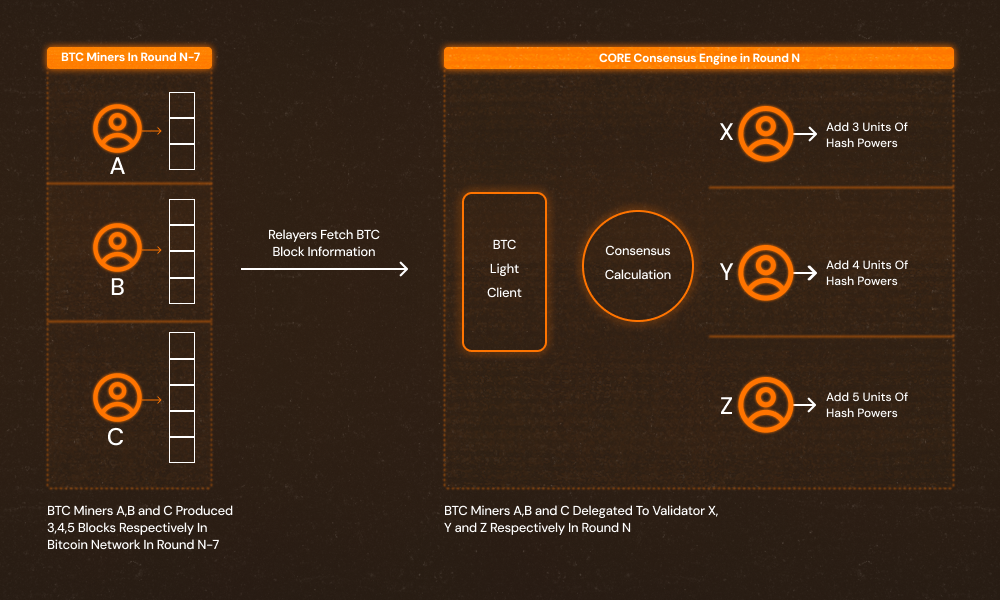

# Delegated Proof of Work (DPoW) in Satoshi Plus
---

## Overview

Delegated Proof of Work (DPoW) is a crucial element of Core's Satoshi Plus consensus mechanism. This system leverages the robust security of Bitcoin mining, integrating it into the Core blockchain to enhance security and incentivize participation without additional costs. Here’s a detailed look at how DPoW operates and its significance.

DPoW enables Bitcoin miners to earn a second block reward on top of their Bitcoin rewards while securing the Core blockchain, creating a symbiotic relationship that benefits both networks. 

## How DPoW Works in Satoshi Plus

On the Bitcoin network, Bitcoin miners generate hash power to secure the Bitcoin network, validate transactions, and earn Bitcoin rewards. In order to even their rewards out over time, Bitcoin miners often contribute their hash power to mining pools, which use the aggregated hash power to increase the pool’s overall chances of mining a Bitcoin block and receiving Bitcoin in return. DPoW integrates Bitcoin mining directly into the Core's security protocol through a delegation system. Here’s a step-by-step breakdown of its operation:

1. **Mining Integration**: Bitcoin miners continue their standard mining activities but with the additional step of signaling their support for Core blockchain. This is achieved by including a special transaction in the Bitcoin blocks they mine, which specifies the Core Validator they wish to support.

2. **Metadata in Bitcoin Blocks**: In the mined Bitcoin block, miners add metadata in the `op_return` field. This metadata includes the address of the Core Validator and the address for receiving CORE token rewards, effectively delegating a portion of their hashing power to the Core network.

3. **Validator Support**: By including this information, miners delegate their computational power to Validators on Core. These Validators use the delegated power to participate in the Core blockchain's version of block validation and creation.

4. **Relayers**: Relayers are responsible for monitoring the Bitcoin network and transmitting blocks and transaction data to the Core network. Within the Core network, an on-chain embedded BTC light client processes the incoming data from relayers and forwards the delegation information (including hash power and Non custodial staking) to the "Delegation Hub". The Delegation Hub serves as the central component responsible for managing and overseeing delegations within the Core network.  During a 1-day round, the Core network calculates the DPoW for each validator by counting the number of blocks the miners delegated to each validator _one week prior_. If the round occurs on a Thursday, for example, Core will tabulate the hash power delegated to each validator by counting blocks from _last_ Thursday.

5. **Reward Mechanism**: In return for their contribution, miners receive additional rewards in the form of CORE tokens, on top of the usual Bitcoin mining rewards. This dual-reward system incentivizes miners to participate in the DPoW process without needing to divert resources away from Bitcoin mining.

## Step by Step Process

1. **Mining Bitcoin Blocks:** Bitcoin miners continue their primary role of mining blocks on the Bitcoin network using Proof of Work (PoW).

2. **Including Delegation Information:** Miners add two additional pieces of information in the op_return field of the coinbase transaction:
  * **Core Validator Address:** The address of the Core Validator to delegate hash power to.
  * **CORE Token Reward Address:** The address where the miner wants their CORE token rewards sent.

3. **Delegating Hash Power:** This action delegates the miner's hash power to the chosen Core Validator, repurposing existing work without incurring additional costs.

4. **Validator Election:** Validators with higher delegated hash power have a greater chance of being elected to the validator set.

5. **Validator Rewards:** Validators earn rewards for processing blocks, take a small commission, and pass rewards to their delegators, including any Bitcoin miners or mining pools who delegated hash power to them.

6. **Earning Rewards:** Miners or mining pools receive CORE token rewards in addition to their Bitcoin rewards, providing extra incentives.

## Importance of DPoW in Satoshi Plus

* **Enhanced Security:** By integrating Bitcoin’s PoW, Core benefits from Bitcoin’s unmatched security infrastructure, making the Core network more resilient.

* **Increased Incentives:** Bitcoin miners gain an additional revenue stream through CORE token rewards, enhancing their overall profitability without additional energy costs.

* **Symbiotic Relationship:** This system promotes mutual benefits for both the Bitcoin and Core networks, fostering a cooperative environment that strengthens the blockchain ecosystem.

* **Resource Efficiency**: DPoW allows miners to maximize the utility of their existing computational resources. By supporting security of Core ecosystem while conducting their regular Bitcoin mining operations, miners can contribute to two networks simultaneously without additional energy expenditure.

#### **Conclusion**

DPoW is a critical innovation within the Satoshi Plus consensus mechanism, it extends the incentives of the Bitcoin network’s miners to align with Core’s Satoshi Plus consensus mechanism. Core receives Bitcoin miner participation in its security, and Bitcoin receives more highly compensated miners. The result is a miner set that is more heavily incentivized to secure both Bitcoin and Core. 

